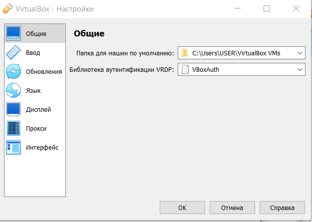
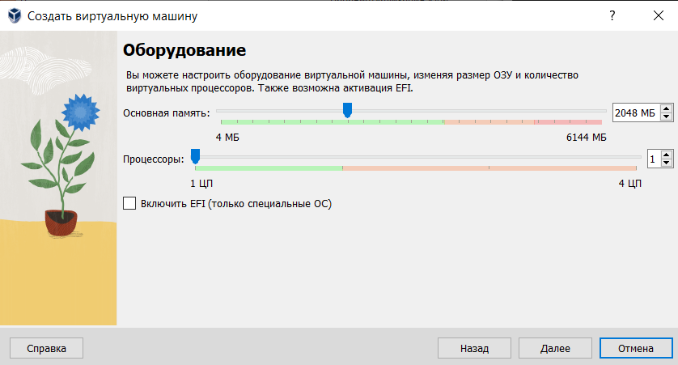
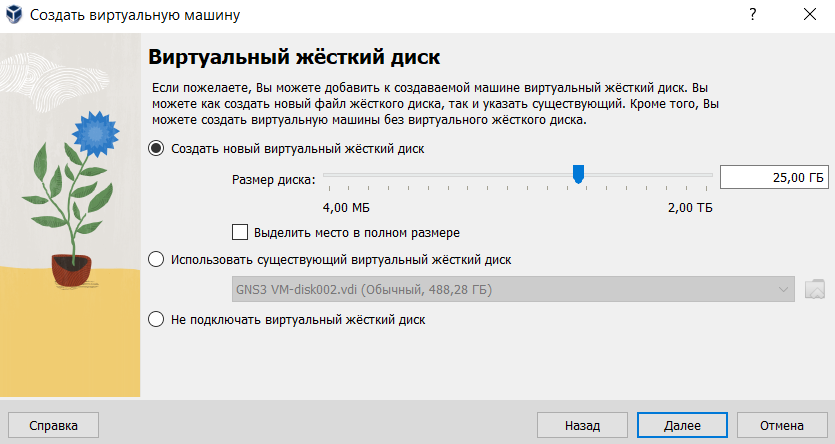
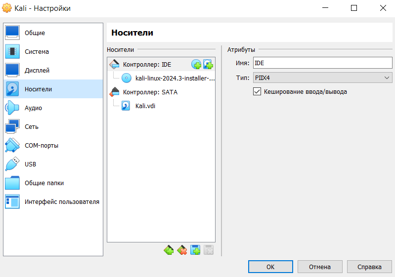

---
## Front matter
lang: ru-RU
title: Защита индивидуального проекта (этап 5)
subtitle: Информационная безопасность
author:
  - Данзанова С. З.
institute:
  - Российский университет дружбы народов, Москва, Россия
date: 2024

babel-lang: russian 
babel-otherlangs: english 
mainfont: Arial 
monofont: Courier New 
fontsize: 12pt

## Formatting pdf
toc: false
toc-title: Содержание
slide_level: 2
aspectratio: 169
section-titles: true
theme: metropolis
header-includes:
 - \metroset{progressbar=frametitle,sectionpage=progressbar,numbering=fraction}
 - '\makeatletter'
 - '\beamer@ignorenonframefalse'
 - '\makeatother'
---

# Информация
## Докладчик

:::::::::::::: {.columns align=center}
::: {.column width="70%"}

  * Данзанова Саяна
  * Студентка группы НПИбд-01-21
  * Студ. билет 1032217624
  * Российский университет дружбы народов

:::
::: {.column width="30%"}

:::
::::::::::::::

# Цель работы

- Настроить рабочее пространство для выполнения индивидуального проекта, приобрести практические навыки установки операционной системы на виртуальную машину.

# Теоретическая справка

**Kali Linux** — это дистрибутив Linux, разработанный Offensive Security для тестирования на проникновение, анализа безопасности и цифровых исследований.  [1].

# Ход выполнения лабораторной работы

## Установка и конфигурация операционной системы на виртуальную машину

1. Проверьте в свойствах VirtualBox месторасположение каталога для виртуальных машин.

{ #fig:001 width=70% height=70% }

# Установка и конфигурация операционной системы на виртуальную машину

2. Создайте новую виртуальную машину. Укажите имя виртуальной машины (Kali), тип операционной системы — Linux, Ubuntu.

{ #fig:002 width=70% height=70% }

# Установка и конфигурация операционной системы на виртуальную машину

3. Укажите размер основной памяти виртуальной машины — 2048
МБ (или большее число, кратное 1024 МБ, если позволяют технические характеристики вашего компьютера).

{ #fig:003 width=70% height=70% }

# Установка и конфигурация операционной системы на виртуальную машину

4. Задайте конфигурацию жёсткого диска — загрузочный,VDI (BirtualBox Disk
Image), динамический виртуальный диск. Задайте размер диска — 25 ГБ (или больше). 

{ #fig:004 width=70% height=70% }

# Установка и конфигурация операционной системы на виртуальную машину

{ #fig:005 width=70% height=70% }

# Установка и конфигурация операционной системы на виртуальную машину

5. Добавьте новый привод оптических дисков и выберите образ операционной системы.

{ #fig:006 width=70% height=70% }

# Установка и конфигурация операционной системы на виртуальную машину

6. Выбираем страну:

{ #fig:011 width=70% height=70% }

# Установка и конфигурация операционной системы на виртуальную машину

7. Задаем hostname, пароль и полное имя. 

{ #fig:012 width=70% height=70% }

# Установка и конфигурация операционной системы на виртуальную машину

8. Настроим часовой пояс и время

{ #fig:013 width=70% height=70% }

# Установка и конфигурация операционной системы на виртуальную машину

9. Настроим диски

{ #fig:014 width=70% height=70% }

{ #fig:015 width=70% height=70% }

# Вывод

## 

- Были получены практические навыки настройки рабочего пространства для выполнения индивидуального проекта, приобретены практические навыки установки операционной системы на виртуальную машину.

# Список литературы. Библиография

[1] Сайт Kali Linux: https://www.kali.org/

[2] Документация Kali Linux: https://docs.kali.org/

[3] Kali Linux Forum: https://forums.kali.org/