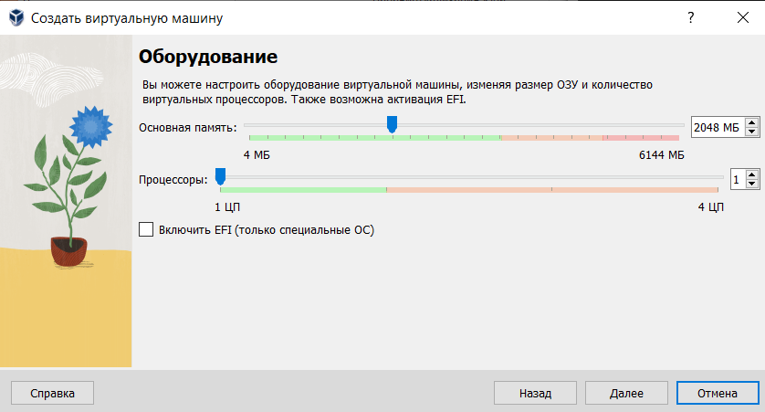

---
## Front matter
title: "Индивидуальный проект. Информационная безопасность"
subtitle: "Этап 5."
author: "Выполнила: Данзанова Саяна, НПИбд-01-21, 1032217624"

## Generic otions
lang: ru-RU
toc-title: "Содержание"

## Bibliography
bibliography: bib/cite.bib
csl: pandoc/csl/gost-r-7-0-5-2008-numeric.csl

## Pdf output format
toc: true # Table of contents
toc-depth: 2
lof: true # List of figures
fontsize: 12pt
linestretch: 1.5
papersize: a4
documentclass: scrreprt
## I18n polyglossia
polyglossia-lang:
  name: russian
  options:
	- spelling=modern
	- babelshorthands=true
polyglossia-otherlangs:
  name: english
## I18n babel
babel-lang: russian
babel-otherlangs: english
## Fonts
mainfont: PT Serif
romanfont: PT Serif
sansfont: PT Sans
monofont: PT Mono
mainfontoptions: Ligatures=TeX
romanfontoptions: Ligatures=TeX
sansfontoptions: Ligatures=TeX,Scale=MatchLowercase
monofontoptions: Scale=MatchLowercase,Scale=0.9
## Biblatex
biblatex: true
biblio-style: "gost-numeric"
biblatexoptions:
  - parentracker=true
  - backend=biber
  - hyperref=auto
  - language=auto
  - autolang=other*
  - citestyle=gost-numeric
## Pandoc-crossref LaTeX customization
figureTitle: "Рис."
tableTitle: "Таблица"
listingTitle: "Листинг"
lofTitle: "Список иллюстраций"
lolTitle: "Листинги"
## Misc options
indent: true
header-includes:
  - \usepackage{indentfirst}
  - \usepackage{float} # keep figures where there are in the text
  - \floatplacement{figure}{H} # keep figures where there are in the text
---

# Цель работы

Настроить рабочее пространство для выполнения индивидуального проекта, приобрести практические навыки установки операционной системы на виртуальную машину.

# Теоретическое введение

**Kali Linux** — это дистрибутив Linux, разработанный Offensive Security для тестирования на проникновение, анализа безопасности и цифровых исследований.  [1].

Основные особенности Kali Linux:

 - Специализированные инструменты: Kali Linux поставляется с широким набором инструментов для различных задач, включая: сетевое сканирование, проверка на уязвимости, еxploitation, forensic analysis, reverse engineering.
 - Основан на Debian: Kali Linux основан на Debian, стабильном и надежном дистрибутиве Linux, что обеспечивает высокую совместимость и стабильность.
 - Обновляемый репозиторий: Kali Linux имеет постоянно обновляемый репозиторий с последними версиями инструментов, что гарантирует актуальность и безопасность.
 - Поддержка множества архитектур: Kali Linux доступен для различных архитектур, включая x86, ARM и другие.
 - Пользовательский интерфейс: Kali Linux использует графический интерфейс GNOME, но также доступен в варианте с минимальным графическим интерфейсом или без него.
 - Документация и поддержка:  Kali Linux имеет обширную документацию, а также активное сообщество пользователей, которые предлагают помощь и поддержку.

Использование Kali Linux:

 - Тестирование на проникновение: Kali Linux используется для поиска и анализа уязвимостей в системах и приложениях.
 - Анализ безопасности: Kali Linux помогает анализировать сетевой трафик и выявлять подозрительную активность.
 - Цифровые исследования: Kali Linux используется для сбора, анализа и сохранения цифровых улик.
 - Обучение и исследования: Kali Linux является ценным инструментом для обучения безопасности и проведения научных исследований.
 
# Выполнение работы

## Установка и конфигурация операционной системы на виртуальную машину

1. Проверьте в свойствах VirtualBox месторасположение каталога для виртуальных машин.

{ #fig:001 width=70% height=70% }

2. Создайте новую виртуальную машину. Укажите имя виртуальной машины (Kali), тип операционной системы — Linux, Ubuntu.

{ #fig:002 width=70% height=70% }

3. Укажите размер основной памяти виртуальной машины — 2048
МБ (или большее число, кратное 1024 МБ, если позволяют технические характеристики вашего компьютера).

{ #fig:003 width=70% height=70% }

4. Задайте конфигурацию жёсткого диска — загрузочный,VDI (BirtualBox Disk
Image), динамический виртуальный диск. Задайте размер диска — 25 ГБ (или больше). 

{ #fig:004 width=70% height=70% }

{ #fig:005 width=70% height=70% }

5. Добавьте новый привод оптических дисков и выберите образ операционной системы.

{ #fig:006 width=70% height=70% }

6. Выбираем страну:

{ #fig:011 width=70% height=70% }

7. Задаем hostname, пароль и полное имя. 

{ #fig:012 width=70% height=70% }

8. Настроим часовой пояс и время

{ #fig:013 width=70% height=70% }

8. Настроим диски

{ #fig:014 width=70% height=70% }

{ #fig:015 width=70% height=70% }

# Вывод

Были получены практические навыки настройки рабочего пространства для выполнения индивидуального проекта, приобретены практические навыки установки операционной системы на виртуальную машину.

# Список литературы. Библиография

[1] Сайт Kali Linux: https://www.kali.org/

[2] Документация Kali Linux: https://docs.kali.org/

[3] Kali Linux Forum: https://forums.kali.org/